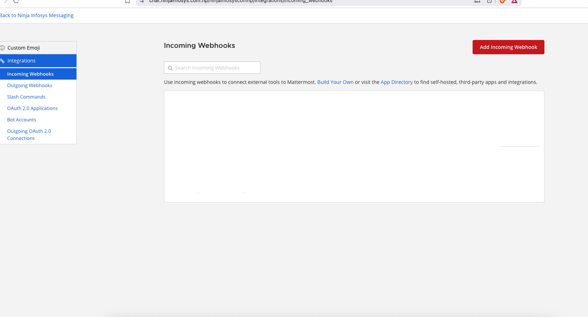
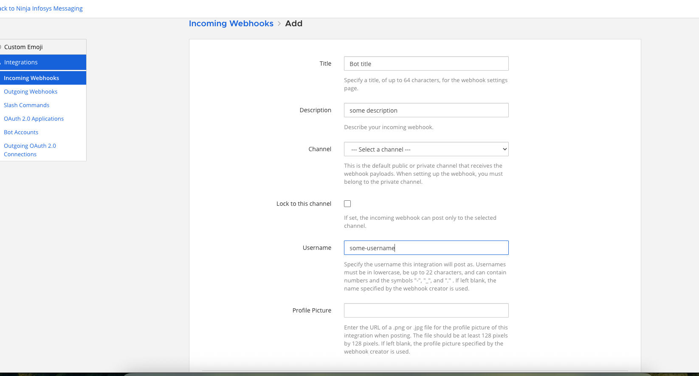
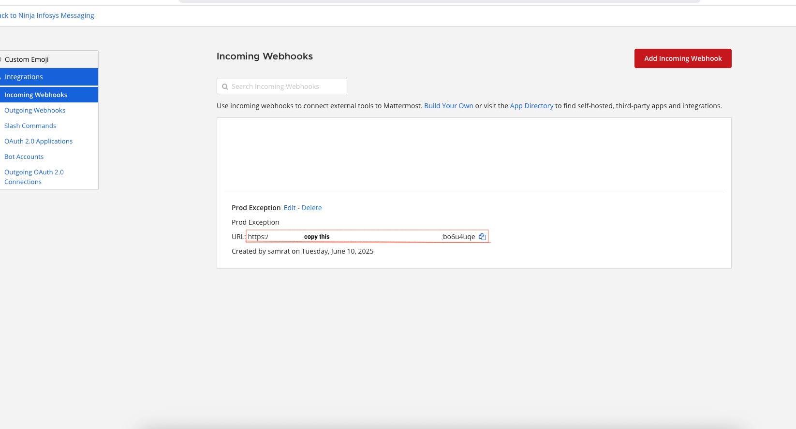
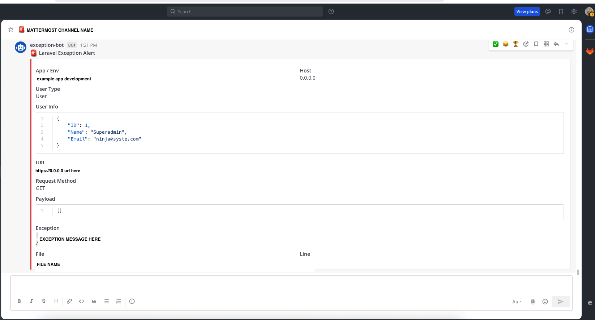
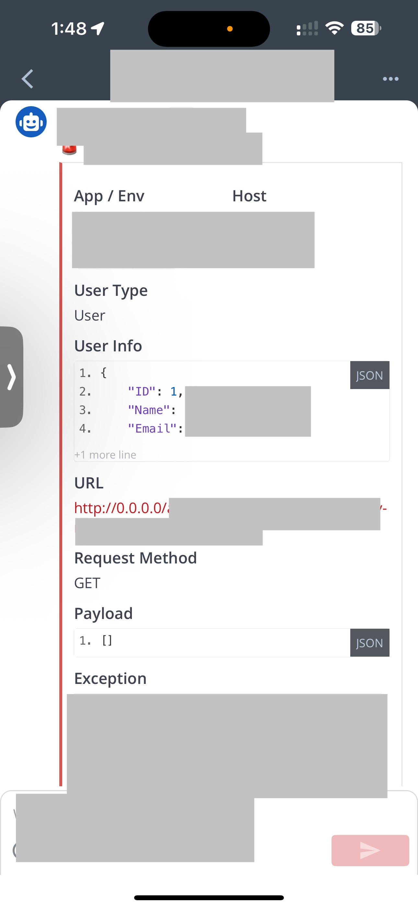

# 🚨 Mattermost Laravel [](https://packagist.org/packages/samrat415/mattermost-laravel)


A Laravel package to send exception alerts directly to [Mattermost](https://mattermost.com) via incoming webhooks.  
Built using [Spatie Laravel Package Tools](https://github.com/spatie/laravel-package-tools) for clean and automatic integration.

---

## 🧭 Overview

This package catches exceptions in non-API requests and automatically sends a rich, formatted message to your Mattermost channel with details like:

- App/environment
- Host
- User info
- URL & payload
- Exception message, file, and line

---

## 🖼️ Screenshots

**Step-by-step setup:**

| Step | Image |
|------|-------|
| 1️⃣ Add incoming webhook |  |
| 2️⃣ Configure channel & description |  |
| 3️⃣ Copy the webhook URL |  |

**Example Message on Web & Mobile:**

| Web | Mobile |
|-----|--------|
|  |  |

---

## 📦 Installation

```bash
composer require samrat415/mattermost-laravel
````

---

## ⚙️ Setup

### 1. 🧪 Create Incoming Webhook on Mattermost

Follow the screenshots above or these steps:

* Go to **Main Menu > Integrations > Incoming Webhooks**
* Click **Add Incoming Webhook**
* Select the channel and give a name like `Laravel Alerts`
* Copy the generated **Webhook URL**

---

### 2. 🔐 Environment Variables

Add the following to your `.env` file:

```env
MATTERMOST_WEBHOOK_URL=https://your-mattermost/hooks/your-webhook-url
MATTERMOST_ALERT_ENABLED=true
MATTERMOST_REDIRECT_BACK=true
```

| Key                        | Description                                               |
| -------------------------- | --------------------------------------------------------- |
| `MATTERMOST_WEBHOOK_URL`   | Your Mattermost webhook URL                               |
| `MATTERMOST_ALERT_ENABLED` | Set to `false` to temporarily disable notifications       |
| `MATTERMOST_REDIRECT_BACK` | Set to `false` to prevent redirecting back after an error |

---

### 3. ⚙️ Publish Config (Optional)

```bash
php artisan vendor:publish --tag="mattermost-laravel-config"
```

This will publish the configuration file to:

```
config/mattermost-alert.php
```

---

## ✅ Automatic Exception Reporting

This package automatically hooks into Laravel’s exception handling:

* Only for **non-API web requests**
* Catches exceptions and reports to Mattermost
* Optionally redirects back with flash alert

---

## 🧾 Blade Alert Message (Optional UI)

To show the alert message on your front-end after exception handling, add this snippet to your main layout file:

```blade
@if (session()->has('alert'))
    <div class="alert alert m-2 bg bg-{{ session()->get('alert')['type'] }} p-4 text-white rounded alert-dismissible" role="alert">
        <h4 class="alert-heading d-flex align-items-center">
            <span class="alert-icon rounded-circle"
                  style="border: 2px solid white; padding: 8px; display: inline-flex; align-items: center; justify-content: center;">
                @if (session()->get('alert')['type'] === 'success')
                    <i class="bx bx-coffee"></i>
                @elseif(session()->get('alert')['type'] === 'danger')
                    <i class="bx bx-error"></i>
                @else
                    <i class="bx bx-show"></i>
                @endif
            </span>
            &nbsp;
            {{ session()->get('alert')['title'] }}
        </h4>
        <hr>
        <p class="mb-0">{{ session()->get('alert')['message'] }}</p>
        <button type="button" class="btn-close" data-bs-dismiss="alert" aria-label="Close"></button>
    </div>
@endif
```

---

## 🧪 Testing

Throw an exception anywhere in your Laravel web route or controller to test.
If everything is configured properly, the error will show up in your Mattermost channel.

---

## 🔒 License

MIT © [Samrat Thapa](https://github.com/samrat415)

```

Let me know if you want badges, composer.json info, or usage examples added too.
```
